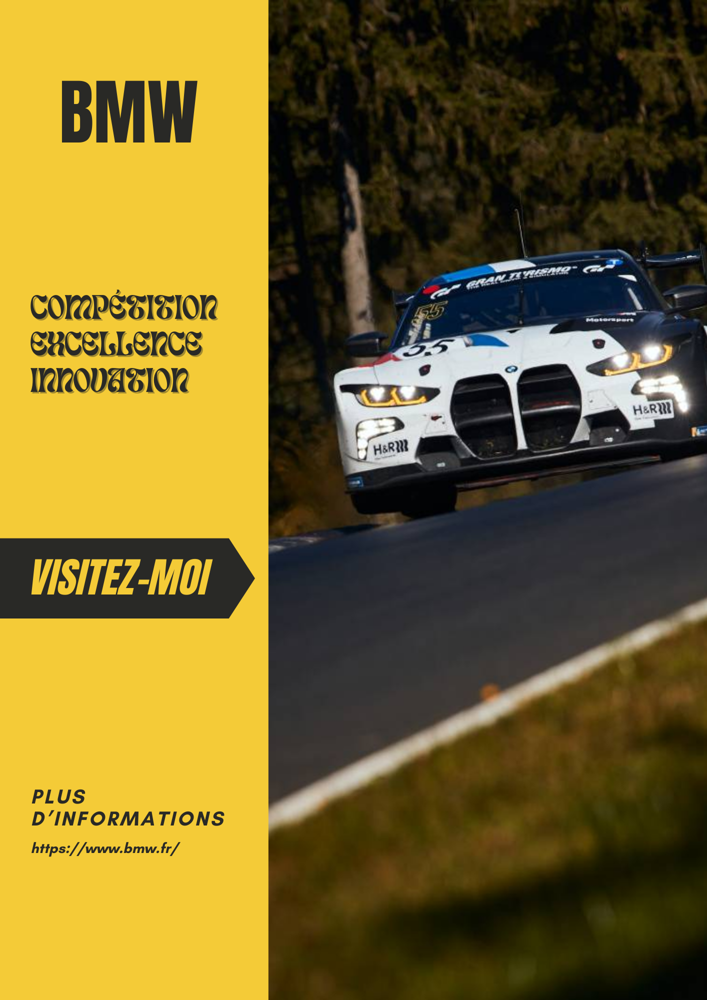

# Projet de présentation de la M4 CSL

Ce README documente la conception du projet de présentation pour la BMW M4 CSL. Il fournit des informations sur les éléments clés de conception, le design, et la réactivité du site.

## Vue d'Ensemble

Le projet de présentation de la BMW M4 CSL est un site web statique conçu pour présenter les caractéristiques, son histoire et les performances de la BMW M4 CSL. Le site est développé avec HTML, CSS et JavaScript pour apporter un style design et des fonctionnalités interactives.

## Design

Le design du site est élégant et moderne, mettant en avant l'esthétique sportive de la BMW M4 CSL. Le site utilise des images de haute qualité pour présenter la voiture sous différents angles.

La mise en page est conçue de manière responsive afin de garantir une expérience utilisateur optimale sur tous les appareils.

## Exemples de fonctionnalités

- Carrousel d'images qui met en avant différents aspects de la conception ou encore de la conduite de la BMW M4 CSL. Les visiteurs peuvent faire défiler les images et obtenir des informations détaillées sur chaque aspect.

- Configurateur permettant aux visiteurs de personnaliser une BMW M4 selon leurs préférences. Ils peuvent choisir la couleur extérieure et les jantes à l'aide de menus déroulants interactifs. L'image de la voiture se met à jour en temps réel pour afficher la personnalisation sélectionnée.

- Données statistiques chiffrées présentant des compteurs animés qui mettent en avant des chiffres clés de la BMW M4 CSL.

	

		<i>KLS</i>
	

	

